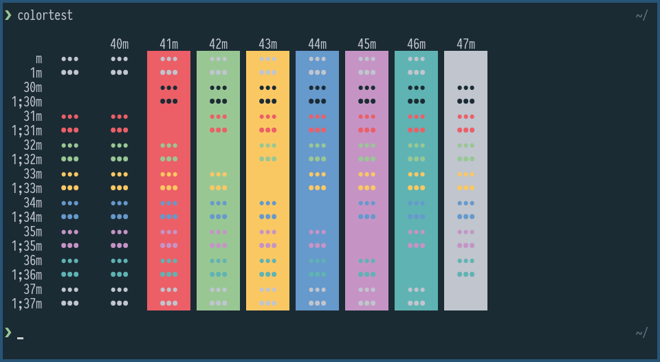
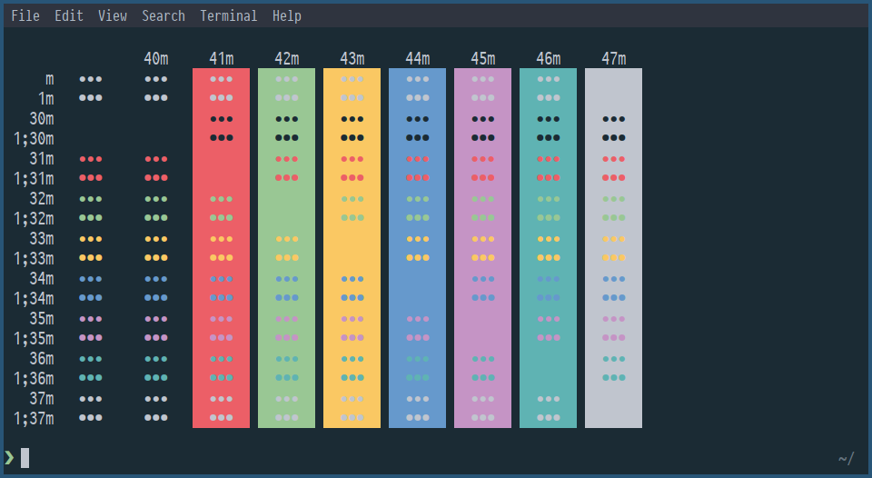
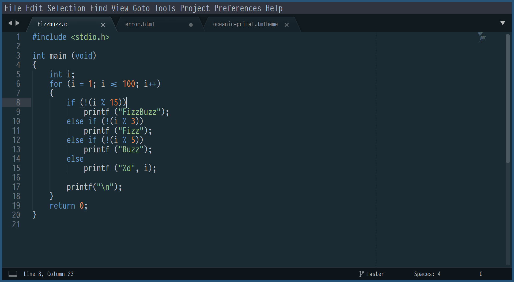

# Oceanic Primal color scheme

[](https://opensource.org/licenses/MIT)

[**Oceanic Primal**](https://barlog.li/projects/oceanic-primal) is a color theme that built in opposite to [base16](http://chriskempson.com/projects/base16/) color themes with fewer color and more ocean.

Based on [Oceanic Primal palette](https://github.com/oceanic-primal/palette), inspired by [Oceanic-Next.vim](https://github.com/mhartington/oceanic-next)

-   [Oceanic Primal for Vim and Neovim](https://github.com/barlog-m/oceanic-primal-vim)
-   [Oceanic Primal for IntelliJ IDEA](https://github.com/barlog-m/oceanic-primal-idea)

[colortest](https://github.com/barlog-m/colortest) bash script

### [Kitty](https://sw.kovidgoyal.net/kitty/) terminal



Put config from ./kitty/kitty.conf into your.

### [Gnome Terminal](https://help.gnome.org/users/gnome-terminal/stable/)



```bash
dconf load /org/gnome/terminal/legacy/profiles:/:PROFILE_ID/ < ./gnome-terminal/gnome-terminal-oceanic-primal.dconf
```

### [Sublime Text](https://www.sublimetext.com/)



Font on screenshots is [PragmataPro](https://fsd.it/shop/fonts/pragmatapro/)
